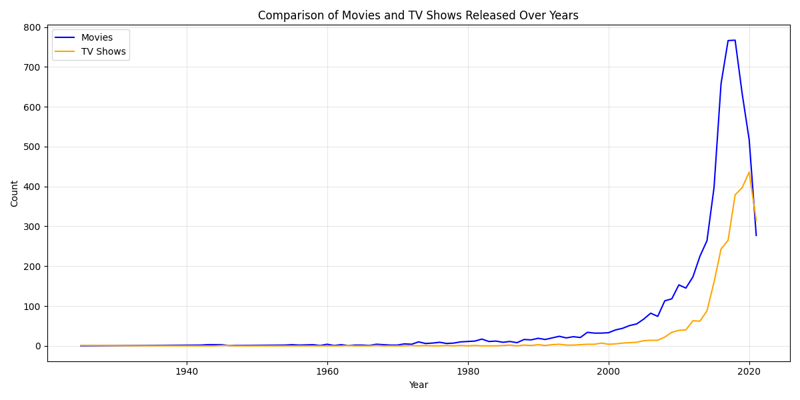
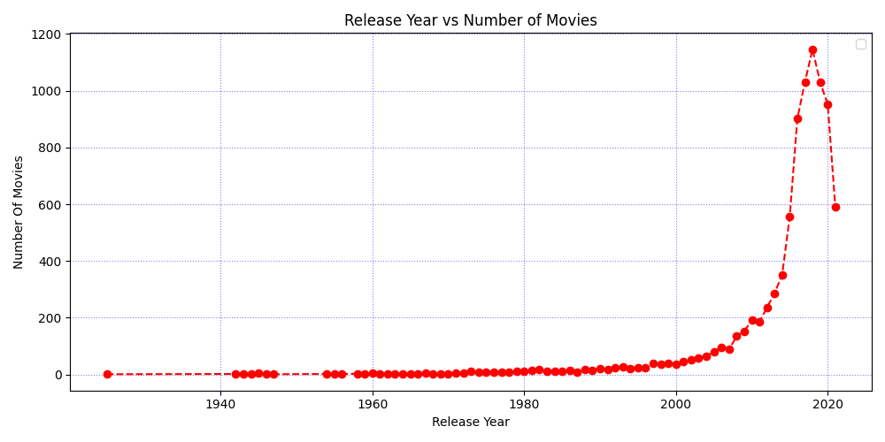

# 🎬 Netflix Titles Dataset – Exploratory Data Analysis (EDA)

This project performs a comprehensive exploratory data analysis (EDA) on the Netflix Movies and TV Shows dataset using **Python (Pandas, NumPy & Matplotlib)**.  
The goal is to clean the dataset, handle missing values, analyze trends, and **visualize patterns** to understand content distribution on Netflix.

---

## 📌 Project Objectives

- Load and inspect raw dataset
- Clean categorical and date-based fields
- Handle missing values appropriately
- Extract useful features (Year Added, Duration Split, etc.)
- Analyze Netflix content distribution, growth trends, genres, ratings
- **Visualize key insights using Matplotlib**

---

## 📂 Dataset Info

- **Total Records:** 8,807
- **Columns:** 12 original + additional engineered features
- **Dataset Source:** Kaggle  
🔗 https://www.kaggle.com/shivamb/netflix-shows

---

## 🧹 Data Cleaning Performed

| Task | Description |
|------|-------------|
| Missing values | Filled with `"Unknown"` where applicable |
| Whitespace removal | Used `.str.strip()` to standardize text |
| Date parsing | Converted `date_added` to datetime format |
| Feature extraction | Extracted `added_year`, `added_month` |
| Duration cleanup | Split duration into numeric + unit |
| Validation | Checked duplicates, types, null values |

---

## 📊 Data Visualization

Here are some key charts generated from the analysis:

### 1. Movies vs TV Shows
*(Comparison of total content available)*

### 2. Growth of Content Over Years
*(How Netflix content library expanded over time)*

### 3. Distribution of Ratings
*(Most common age ratings on Netflix)*

## 📈 Key Insights Derived

### 🎥 Content Type Distribution
| Type | Percentage |
|------|------------|
| Movies | ~69.6% |
| TV Shows | ~30.4% |

> Netflix has a larger catalog of Movies than long-form TV Shows.

### 📈 Growth Trend by Year Added
- The highest number of titles were added in **2019**.
- Steady growth observed after **2015**.
- Slight decline post-2020 due to pandemic effects.

### 🌍 Top Countries Producing Netflix Titles
| Rank | Country | Titles |
|------|---------|--------|
| 1 | United States | 2818 |
| 2 | India | 972 |
| 3 | United Kingdom | 419 |
| 4 | Japan | 245 |
| 5 | South Korea | 199 |

> US dominates Netflix’s content library, while India shows rapid growth.

### 🕒 Content Duration Insights
| Type | Avg. Duration |
|------|---------------|
| Movies | ~100 minutes |
| TV Shows | ~1.7 seasons |

> Most shows are **mini-series** instead of long multi-season productions.

---

## 🛠 Tech Stack

- Python
- Pandas
- NumPy
- **Matplotlib (For Visualization)**

---

## 🚀 Future Enhancements

🔧 Planned Additions:
- [x] **Data Visualizations (Matplotlib)** ✅ *(Completed)*
- [ ] WordCloud for categories and actors
- [ ] Interactive Dashboard (Power BI / Tableau)
- [ ] ML-Based Content Recommendation

---

## 👨‍💻 Author

**Ajay Singh** 📌 Aspiring Data Analyst | Python Enthusiast

🔗 **LinkedIn:** www.linkedin.com/in/ajay-singh-data

---

### ⭐ If you like this project, consider giving the repository a star on GitHub!
